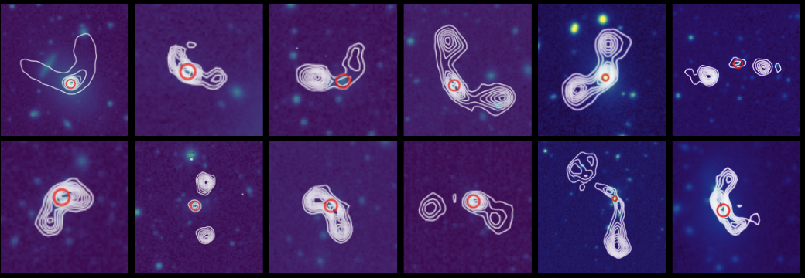
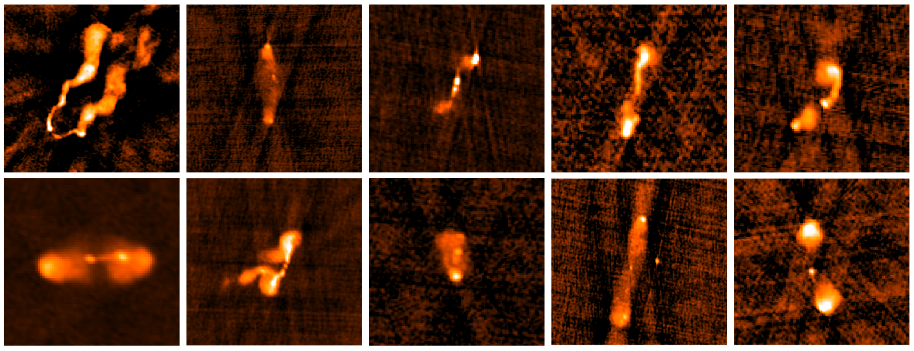

### What can we learn from AGN with bent jets?
AGN with bent jets can teach us a great deal about their environment. This is because the jets are being bent back by ram pressure fro a dense, gaseous surrounding medium, such as that we can see in the intracluster medium of galaxy clusters. A similar medium can be observed in a small subset of groups, but how much gas actually exists here is not well characterized because of how difficult it is to observe. AGN with bent jets, however, can help us answer this question! Read on to find out how!

### How does environment affect AGN jets?

In [Morris et al. 2022](https://ui.adsabs.harvard.edu/abs/2022AJ....163..280M/abstract), we investigate this very question by finding galaxies that neighbor AGN with bent and unbent jets in order to understand what kind of environments they exist in and if there is a difference that may contribute to some AGN being bent while others are not. We found that bent AGN are more likely to exist in environments with at least 3 neighbors, while unbent AGN are more likely to be isolated or in a pair. For AGN in groups with three or more neighbors, bent AGN are more likely to exist in denser, larger, dynamically younger environments, which may be contributing to why they are so bent. To read more about these differences and what they may indicate, [check out my paper!](https://ui.adsabs.harvard.edu/abs/2022AJ....163..280M/abstract)

### How much gas is in the intragroup medium, anyways?
This is the subject of what I am currently working on. We are using AGN with bent jets to answer this question! Keep an eye out for my upcoming paper for more details!

### Using VLASS to find even more bent AGN!
I'm currently working with three undergraduates that I started working with as part of the [RADIAL](https://public.nrao.edu/odi/radial/) program over the summer, and have continued to work with. They are working on using the Very Large Array Sky Survey to find AGN with bent jets.
